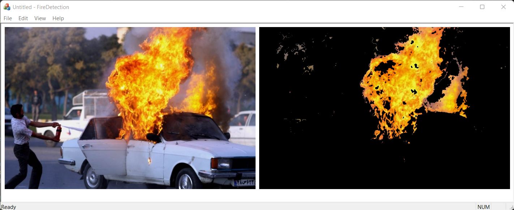
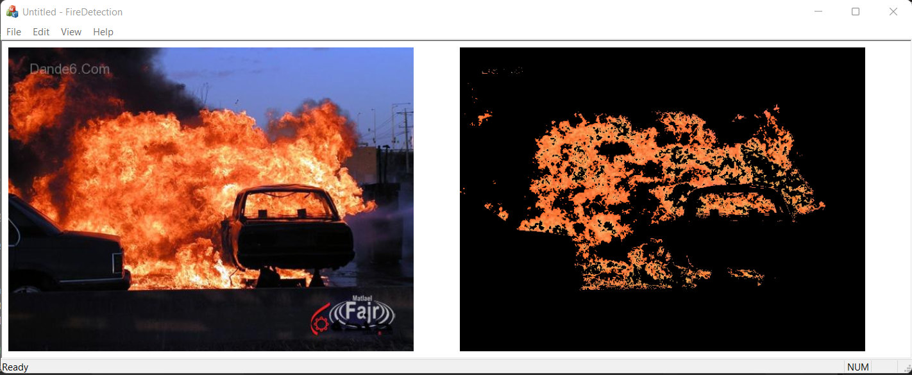
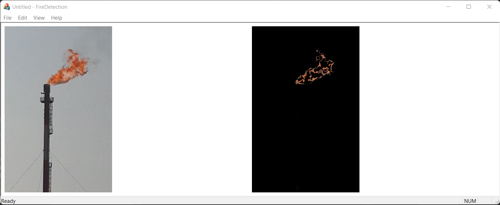

# SDI Based Fire Detection Application
In this application, which is written in C++ and MFC API, can Detect Fire on image

This application is written for Windows.

## TechStack/framework used
- C++
- [OpenCV](https://opencv.org/releases/)
- [Microsoft Foundation Class](https://learn.microsoft.com/en-us/cpp/mfc/mfc-desktop-applications?view=msvc-170) (MFC)

## Dataset
All of images are in <code>Iamges</code> folder.

## Installation
Create a dialogue based MFC application and add this files in your project.

## Results

## License
This project is licensed under the [MIT License](LICENSE).
